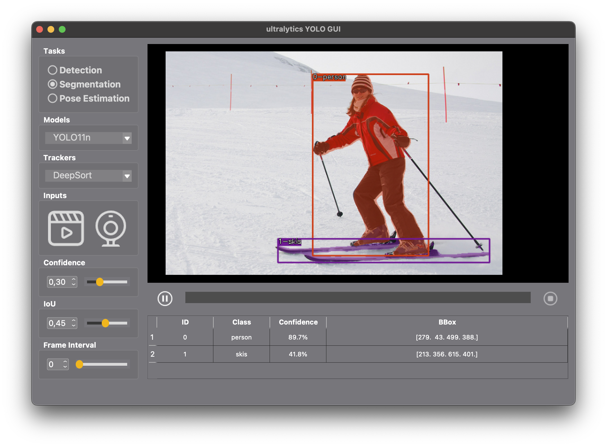

# ultralytics-YOLO-DeepSort/ByteTrack-PyQt-GUI
a GUI application, which uses ultralytics YOLO for  Object Detection/Tracking, Human Pose Estimation/Tracking from images, videos or camera. 

All python scripts performing detection, pose and segmentation using the YOLO model in ONNX.



Supported AI tasks:
- [x] Detection
- [x] Pose Estimation
- [x] Segmentation
- [ ] OBB

Supported Models:
- [x] YOLO11
   - [x] YOLO11-n
   - [x] YOLO11-s
   - [x] YOLO11-m
   - [x] YOLO11-l
   - [x] YOLO11-x
- [x] YOLOv8
   - [x] YOLOv8-n
   - [x] YOLOv8-s
   - [x] YOLOv8-m
   - [x] YOLOv8-l
   - [x] YOLOv8-x

Supported Trackers:
- [x] DeepSort
- [x] ByteTrack

Supported Input Sources:
- [x] local files: images or videos
- [x] Camera
- [x] RTSP-Stream

## Install

Install required packages with pip:

```shell
pip install -r requirements.txt
```

or with conda:

```shell
conda env create -f environment.yml

# activate the conda environment
conda activate yolo_gui
```

## Download weights

Download the model weights：

``````shell
python download_weights.py
``````

The model files are saved in the **weights/** folder.

## Run

```shell
python main.py
```

